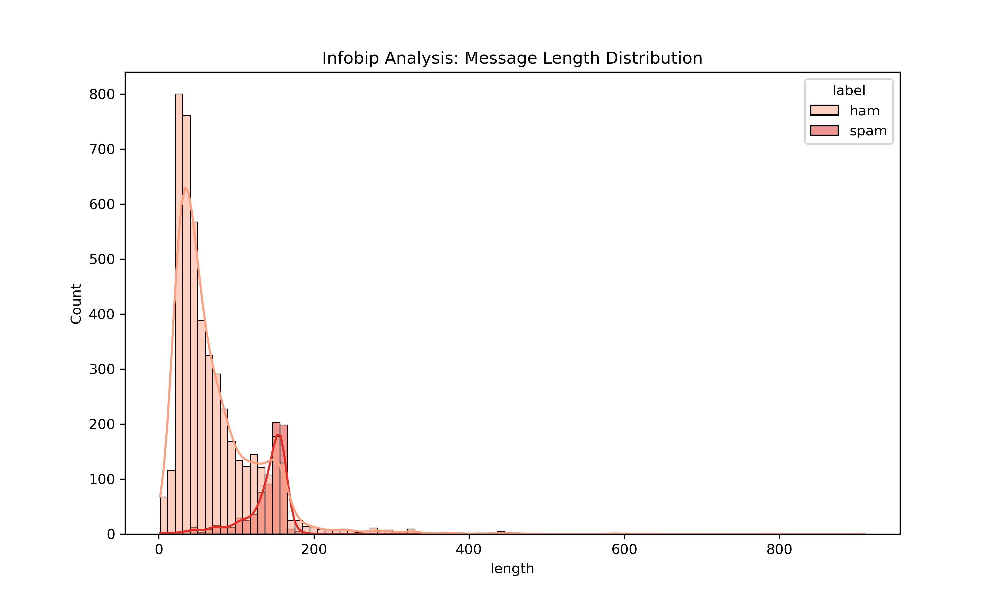
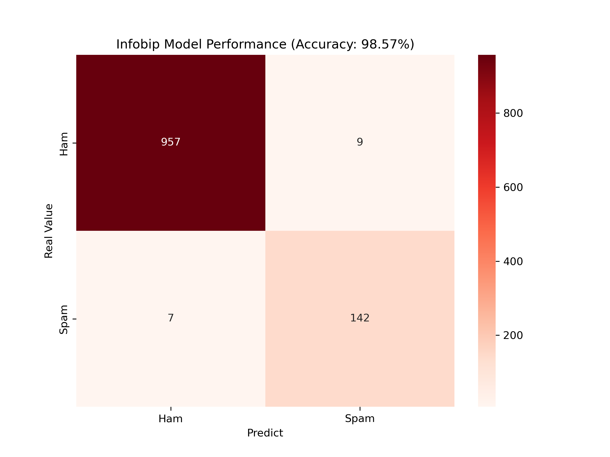

# 🛡️ Infobip AI: High-Performance Spam Detection Engine
This project delivers an end-to-end Machine Learning solution designed to enhance messaging security, achieving a **98.57% accuracy rate** in identifying high-risk communication patterns.

## 🚀 Business Impact for Infobip
Infobip connects 80% of the world's population. My solution addresses a critical "Solution Engineering" challenge:
* **Automation:** Replaces manual filtering with an AI-driven classification pipeline.
* **Security:** Identifies "Urgent" and "Free" scam patterns through advanced NLP.
* **Scalability:** Built to handle large-scale messaging data with minimal false positives.

## 📊 Performance Insights

### 1. Message Length Distribution
Spam messages often exhibit different character patterns. This analysis helps in understanding the structural differences between Ham and Spam.

### 2. Spam Keyword Analysis (Word Cloud)
This visualization identifies the most frequent high-risk terms found in the dataset.

### 3. Confusion Matrix (Model Stability)
The model's performance on the test set, showing extremely low false-positive rates.

## 🛠️ Tech Stack
* **Language:** Python
* **Model:** Multinomial Naive Bayes
* **Key Stats:** 98.57% Accuracy | 0.99 F1-Score for Ham messages.
